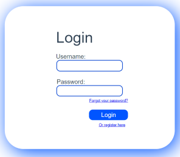
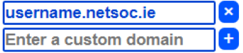

# User Documenation

## Introduction
Webspaces allows you to host your website on our servers! Our web application allows easy creation and management
of your webspace.

## Login Page
Enter your registered Netsoc username and password. Apon login, user is able to create and manage their webspace.


## Create Webspace
User is able create their webspace starting by choosing between various LXD images from a dropdown menu. The 
availabe images are as follows:
```bash
╭─────────────┬──────────────────────────────────────────┬─────────╮
│ ALIAS       │ DESCRIPTION                              │ SIZE    │
├─────────────┼──────────────────────────────────────────┼─────────┤
│ arch        │ Archlinux current amd64 (20210225_04:18) │ 164 MiB │
│ fedora      │ Fedora 32 amd64 (20210224_20:33)         │ 95 MiB  │
│ alpine      │ Alpine 3.13 amd64 (20210215_13:00)       │ 2.4 MiB │
│ debian      │ Debian buster amd64 (20210225_05:24)     │ 74 MiB  │
│ centos      │ Centos 8 amd64 (20210225_07:08)          │ 126 MiB │
│ ubuntu      │ Ubuntu focal amd64 (20210223_07:42)      │ 100 MiB │
│ ubuntu18.04 │ Ubuntu bionic amd64 (20210223_07:42)     │ 98 MiB  │
│ wordpress   │ WordPress 5.5.3                          │ 157 MiB │
╰─────────────┴──────────────────────────────────────────┴─────────╯
```
Along with image choice user is able to set a password for their webspace they choose to create. 
This password will be needed when making changes to the webspace. The password entry is optional 
so the user is also able to create a webspace without a password. Other options include enable SSH,
setup nginx webserver and boot immedialty. After user has configured the webspace according to thier 
choice, they can press 'Initiate Webspace' which will create the webspace as configured by the user 
and then startup the webpace apon creation.

## Config Webspace
Once the webspace has been created, user can further configure their webspace.
The webpspace apon initial creation will have the startup delay and HTTP port set. The user 
is able to change these according to the preference and save the changes by pressing 
'Update Config'.

__Domains - __
The user is able to add custom domains. The availabe domain is entered as the first domain. User 
is not allowed to delete this. The the user is able to add domains by entering their required 
domain name and pressing the '+' button at the side to add the domain to the list of created domains.
If domain deletion is required the user can press the 'x' button beside the domain required deleting. 
This will remove the domain from the list and delete that domain.



__Port Forwards - __
The user is able to enter a external port and an internal port and press the '+' button to add the the 
specified port forward. A random port can be given if the user enters an internal port and leave the 
external port blank and press the '+' button. A random internal port will then be given and that port 
forward will be added to the list. Once a port is created, you are able to delete the port by pressing 
the 'x' button. This will delete and remove the port forward from the list.


## Webspace Status
The user is able to view the status and state of the created webspace. There are options to start, reboot,
regenerate config and shut down the webspace container. Once the container is booted it will change the 
conatiner status to online and show the stats for the container. Stats such as resource usage and network :


| Resource Usage| Network         | 
| ------------- |-------------    | 
| CPU           | Bytes Recieved  | 
| Disk          | Bytes Sent      |  
| Memory        | Packets Recieved|
| Processes     | Packets Sent    |

A graph of real runtime memory usage will also be displayed. 
Reboot will reset all the collected webspace details resource usage and network details.
Shut down container will close the container and change container status to offline. The webspace container 
status will also be cleared along with the memory usage graph.

## Welcome to MkDocs
For full documentation visit [mkdocs.org](https://www.mkdocs.org).